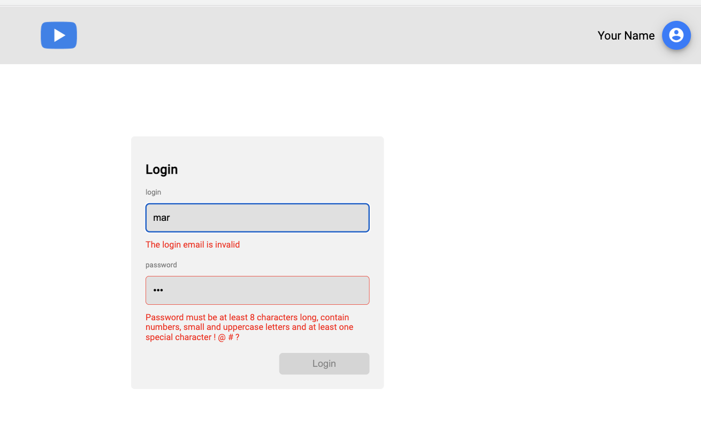
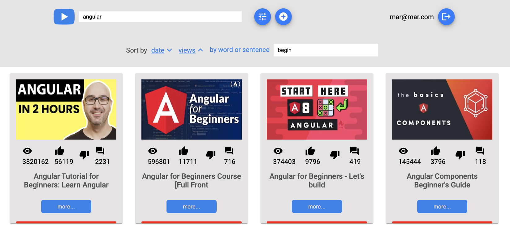
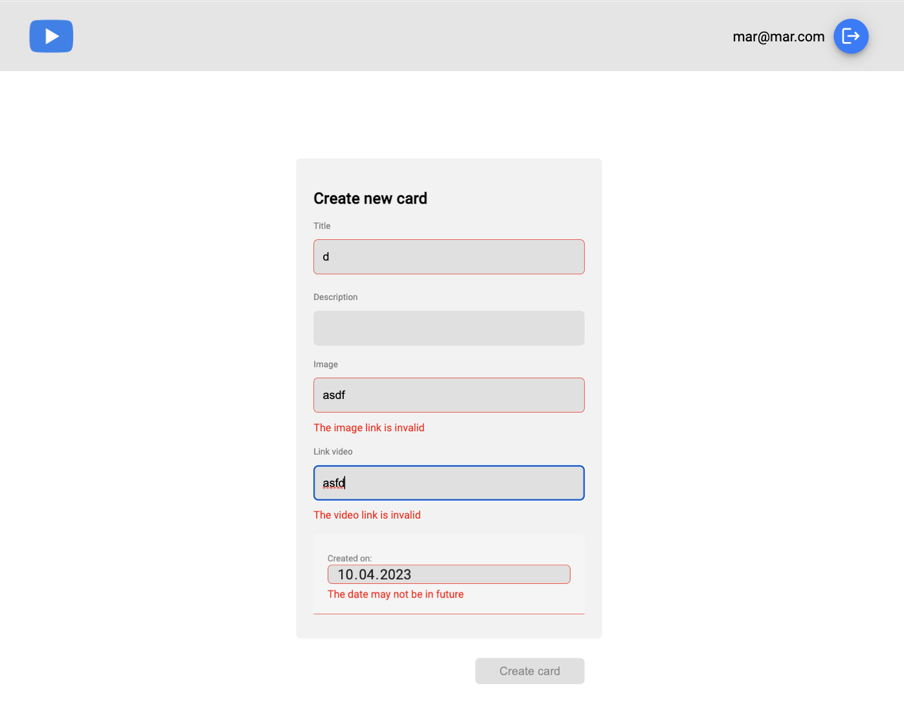
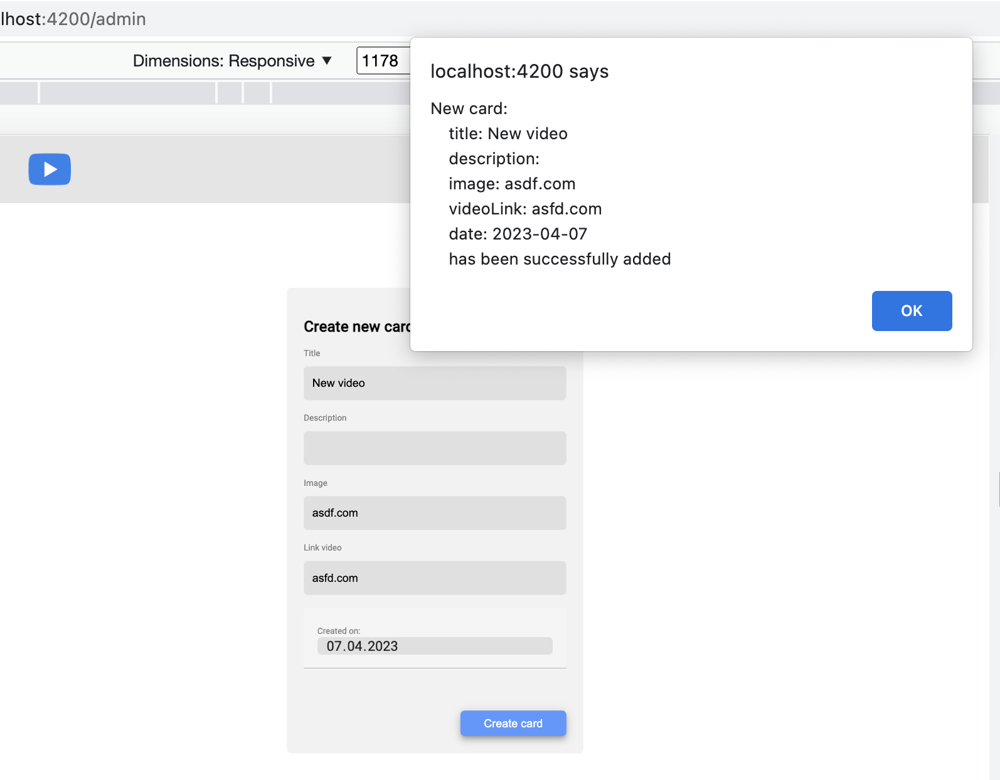
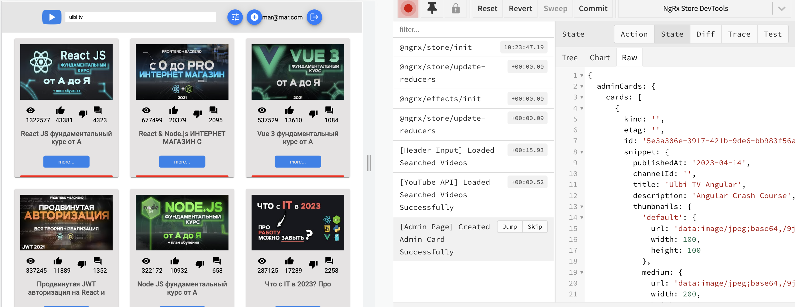
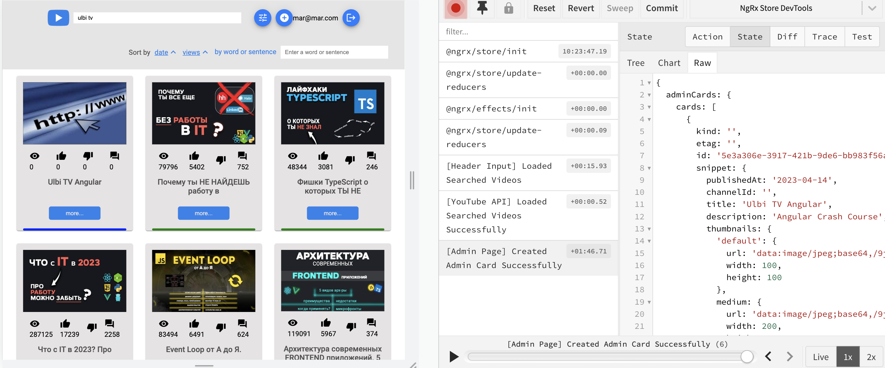

# YoutubeClient

This is an Angular application that renders cards with video details from the YouTube API based on the search query.
This project was generated with [Angular CLI](https://github.com/angular/angular-cli) version 15.2.2.

## Stack used:
- Angular
- RxJS
- NgRX

## Functionality
- Only authenticated users may use the search functionality of the app implemented with `AuthGuard`
- There is a reactive login form with validation

- Once the user loggs in, the token is stored in local storage
- After the user enters at least 3 characters in the Search input field, a list of 15 cards with YouTube videos is fetched from the Youtube API and rendered on the main screen

- If the user clicks on the `Settings` button, a sort/filter dashboard will appear
- Using the search dashboard, the user can:
  - sort the results by date in descending or ascending order
  - sort the results by views in descending or ascending order
  - filter the results by a search query

- The bottom line on the video card indicates how old the video is: 
  - older than 6 months – Red
  - between a month up to 6 months – Yellow
  - between seven days up to a month – Green
  - younger than 7 days – Blue

- Custom `Http Interceptors` were implemented to add the base url and the youtube API key.

- There is an admin page implemented to add a new video card. It uses a reactive form with validation:

- For a successfully added video card, an alert appears:

- The searched Youtube cards are saved to the `Redux` store and retrieved from there

- The admin cards are saved to the `Redux` store and are retrieved from there

## Development server

Run `ng serve` for a dev server. Navigate to `http://localhost:4200/`. The application will automatically reload if you change any of the source files.

## Build

Run `ng build` to build the project. The build artifacts will be stored in the `dist/` directory.

## Deploy

Run `npm run deploy` to deploy the project to gh-pages. 
The deployed version is at: https://rolling-scopes-school.github.io/mlatysheva-ANGULAR2023Q1/

